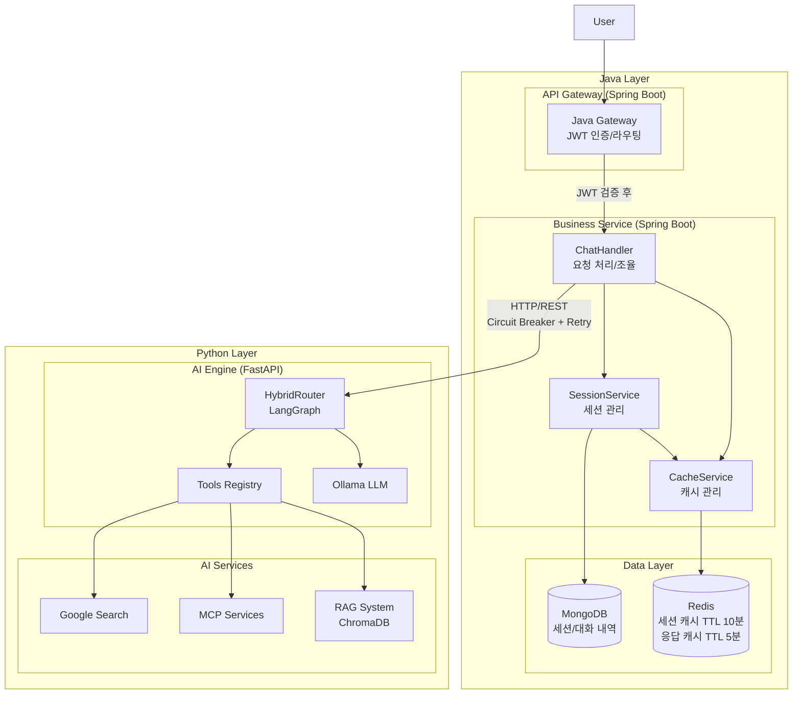
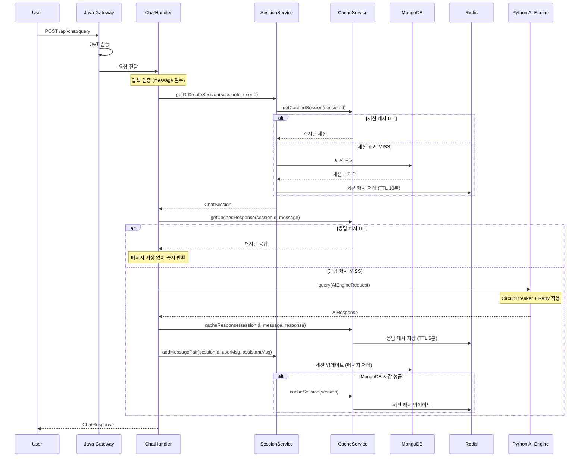

# Java AI Gateway Case Study

## 📋 프로젝트 개요

### 배경 및 목적

**기존 상황:**
- Python FastAPI로 구현된 AI 서비스 (LangGraph 기반 ReAct 패턴)
- 프로토타입 단계의 서비스로 프로덕션 환경 고려사항 부족
- 사용자 인증, 세션 관리, 캐싱 등 엔터프라이즈 기능 부재

**프로젝트 목표:**
- Python AI Engine은 순수하게 AI 추론만 담당하도록 분리
- Java로 비즈니스 로직, 인증, 캐싱 등 프로덕션 필수 기능 구현
- 각 언어의 강점을 살린 Polyglot Architecture 구축


---

## 🏗️ 아키텍처 설계

### 폴리글랏 아키텍처 선택

**왜 두 개의 서비스로?**

1. **Python AI Engine**: AI/ML 생태계 활용
   - LangChain, ChromaDB 등 Python 전용 라이브러리
   - 빠른 AI 프로토타입 개발 및 실험
   - 순수 AI 추론에만 집중

2. **Java Gateway**: 엔터프라이즈 안정성
   - 타입 안정성 및 컴파일 타임 에러 체크
   - 세션 관리, 인증, 캐싱 등 비즈니스 로직
   - MongoDB를 통한 대화 컨텍스트 영구 저장

**결론:** 각 기술의 강점을 살린 **폴리글랏 아키텍처**

### 설계 포인트
- 캐시-퍼스트: HIT 시 메시지 저장 생략으로 지연 최소화, MISS 시에만 컨텍스트/AI 호출 수행
- 회복 탄력성: 서킷브레이커/재시도, 헬스체크 리다이렉트 대응, 안전한 실패 처리
- 프런트 통합: Thymeleaf 페이지(로그인/메인), 정적 리소스 서빙, JS 연동

### 아키텍처 다이어그램




### 핵심 시퀀스 (요청 → 응답)




---

## 🛠️ 기술 스택

### Backend Framework

- **Java 21** - Virtual Thread 지원 최신 LTS 버전
- **Spring Boot 3.3.5** - 엔터프라이즈급 애플리케이션 프레임워크
- **Spring WebFlux** - Reactive 기반 비동기 논블로킹 웹 프레임워크

### Database & Cache
- **MongoDB 7.x** - NoSQL 문서형 데이터베이스 (채팅 세션 및 메시지 저장)
- **Spring Data MongoDB Reactive** - MongoDB Reactive Repository
- **Redis 7.x** - 인메모리 데이터 저장소 (캐싱 및 세션 관리)
- **Lettuce** - Redis Reactive Client

### Resilience & Monitoring
- **Resilience4j 2.2.0** - Circuit Breaker, Retry, Rate Limiter
- **Spring AOP** - 관점 지향 프로그래밍 (Resilience4j 어노테이션 지원)

### Communication
- **WebClient** - 비동기 HTTP 클라이언트 (Python AI Engine 통신)
- **Netty** - 비동기 이벤트 기반 네트워크 프레임워크

### Frontend
- **Thymeleaf 3.x** - 서버 사이드 템플릿 엔진

### Build & Runtime
- **Gradle 8.x** - 빌드 및 의존성 관리


---

## 🚀 핵심 기술 스택 및 선택 이유

### 1. Spring WebFlux (Reactive Web)

**선택 이유:**
- 비동기 논블로킹 I/O로 높은 동시성 처리
- Python AI Engine 호출 시 블로킹 없이 다른 요청 처리 가능
- MongoDB, Redis 모두 Reactive 지원

**전통적인 MVC 대신 RouterFunction 사용:**
```
Controller 방식 (X) → RouterFunction + Handler 방식 (O)
```
- 함수형 프로그래밍 스타일
- 라우팅 로직이 명확하고 테스트 용이

**학습 곡선:**
- `Mono<T>`: 0-1개 결과 반환
- `Flux<T>`: 0-N개 결과 스트림
- 명령형 → 선언형 사고 전환 필요

---

### 2. MongoDB Reactive

**왜 MongoDB?**
- 채팅 메시지는 문서 구조 (JSON)에 자연스럽게 매핑
- 스키마 유연성 (대화 구조 변경 시 마이그레이션 불필요)
- Embedded Document로 메시지 저장 → 조인 불필요

**고민: 관계형 DB vs NoSQL**
- 초기에는 RDBMS 고려
- 하지만 대화 히스토리는 계층 구조 (Session → Messages)
- MongoDB의 Embedded Document가 더 자연스러움

```javascript
ChatSession {
  sessionId: "session_xxx",
  userId: "user_123",
  messages: [  // ✅ 배열로 저장
    {role: "user", content: "질문"},
    {role: "assistant", content: "답변"}
  ]
}
```

---

### 3. Redis (캐싱)

**2단계 캐싱 전략:**

1. **세션 캐시** (TTL 10분)
   - 자주 조회되는 세션 정보
   - MongoDB 부하 감소

2. **쿼리 응답 캐시** (TTL 5분)
   - 동일한 질문 반복 시 즉시 응답
   - AI Engine 호출 비용 절감

**중요한 깨달음: 쿼리 캐시 무효화 불필요**

초기 설계에서는 새 메시지 추가 시 쿼리 캐시를 무효화했으나, 이는 **심각한 문제**였음:

```
문제 상황:
1. 첫 질문 → 캐시 저장
2. 메시지 저장 → 캐시 무효화 (방금 저장한 캐시 삭제!)
3. 같은 질문 → 캐시 MISS (효과 없음)
```

**해결:**
- 쿼리 캐시 무효화 제거
- TTL(5분)로만 관리
- 같은 질문의 답변이 1분 만에 바뀔 일은 거의 없음
- 실시간 데이터(날씨, 주식)도 5분 캐싱이면 충분

**결과:** 캐시 HIT율 대폭 증가 ✅

---

## 🔐 인증 시스템 구현

### Spring Security 없이 JWT 구현

**왜 Spring Security를 쓰지 않았나?**
- 학습 목표: 인증 메커니즘 이해
- Spring Security는 강력하지만 복잡함 (설정만 수백 줄)
- WebFlux와 함께 사용 시 추가 복잡도

**구현 방식:**
```
WebFilter 인터페이스 → @Component 등록 → 자동 적용
```

**핵심 개념:**
- `@Component`만 붙이면 모든 요청에 자동 적용
- Router에서 `.filter()` 명시 불필요
- Public 경로는 필터 내부에서 스킵

**학습한 점:**
- JWT 구조 (Header.Payload.Signature)
- HMAC-SHA256 서명 검증
- 토큰 vs 세션의 차이점 명확히 이해


---

## 🛡️ Resilience4j (장애 대응)

### Circuit Breaker 패턴

**왜 필요한가?**

Python AI Engine이 죽었을 때:
```
Circuit Breaker 없으면:
→ 100명이 동시에 요청
→ 각각 30초씩 타임아웃 대기
→ 총 3000초 = 50분 멈춤 💀
→ Java 서버도 죽음

Circuit Breaker 있으면:
→ 처음 6번만 실패 확인 (3분)
→ Circuit Open! (차단)
→ 이후 94명은 즉시 Fallback (0.01초)
→ Java는 정상 작동 ✅
```

**3가지 상태:**
1. **Closed** 🟢: 정상 (요청 통과)
2. **Open** 🔴: 차단 (즉시 Fallback)
3. **Half-Open** 🟡: 테스트 (조심스럽게 복구 시도)

**실무적 비유:**
```
식당 사장이 재료 공급업체에 전화하는 것과 같음
→ 5번 연속 통화 중 → "오늘은 안 되는구나, 그만 전화하자"
→ 30분 후 한 번만 다시 시도
→ 성공하면 정상 운영 재개
```

**설정값 의미:**
```yaml
failure-rate-threshold: 50  # 실패율 50% 이상이면 차단
sliding-window-size: 10      # 최근 10개 요청으로 판단
wait-duration-in-open-state: 30s  # 30초 차단 유지
```

---

### Retry 패턴

**지수 백오프 (Exponential Backoff):**
```
1차 실패 → 1초 대기
2차 실패 → 2초 대기
3차 실패 → 4초 대기
→ 최종 실패
```

**왜 지수적으로?**
- 서버가 복구 중일 때 시간 확보
- 단순 재시도는 부하만 가중

---


## 🔄 Reactive Programming 학습

### 명령형 → 선언형 사고 전환

**전통적인 방식 (블로킹):**
```java
ChatSession session = sessionRepository.findById(id);  // 대기...
if (session == null) {
    throw new Exception();
}
AiResponse response = aiClient.call(session);  // 대기...
sessionRepository.save(session);  // 대기...
return response;
```

**Reactive 방식 (논블로킹):**
```java
return sessionRepository.findById(id)
    .switchIfEmpty(Mono.error(new Exception()))
    .flatMap(session -> aiClient.call(session))
    .flatMap(response -> sessionRepository.save(session)
        .thenReturn(response));
```

**차이점:**
- 명령형: "이거 하고, 그 다음 이거 해"
- 선언형: "이런 흐름으로 데이터가 흘러가면 돼"

**어려웠던 점:**
- `map` vs `flatMap` 구분
- 에러 핸들링 (`onErrorResume`, `doOnError`)
- 체이닝 길어지면 가독성 저하

**극복 방법:**
- StepVerifier로 테스트 작성하며 이해
- Reactor 공식 문서 Marble Diagram 활용

---


## 🎯 프로젝트 성과

### 정량적 성과

1. **응답 속도 개선**
   - 캐시 HIT 시: 2-3초 → 0.1초 (20배 개선)
   - 캐시 HIT율: 약 60-70% (같은 질문 반복)

2. **동시 처리 능력**
   - WebFlux 비동기 처리로 높은 동시성
   - Circuit Breaker로 장애 격리

3. **시스템 안정성**
   - Python 장애 시에도 Java는 정상 작동
   - Fallback 응답으로 사용자 경험 유지

---

### 정성적 성과

1. **폴리글랏 아키텍처 경험**
   - 각 언어의 강점 활용
   - 서비스 간 통신 (REST API)
   - 책임 분리 (AI vs Business)

2. **엔터프라이즈 패턴 학습**
   - 인증/인가 (JWT)
   - 세션 관리
   - 캐싱 전략
   - 장애 대응 (Circuit Breaker, Retry)
   - 에러 핸들링

3. **Reactive Programming 실전 적용**
   - Spring WebFlux
   - MongoDB Reactive
   - Redis Reactive

---

## 💭 회고 및 개선 방향

### 잘한 점

1. **실용적 설계**
   - MSA 강요 없이 필요에 따른 분리
   - 오버엔지니어링 지양

2. **문제 해결 과정**
   - 쿼리 캐시 무효화 버그 발견 및 해결
   - Redis 직렬화 문제 해결
   - Circuit Breaker 개념 이해

3. **학습 중심 개발**
   - Spring Security 없이 JWT 구현하며 인증 이해
   - Reactive Programming 학습

---

### 아쉬운 점 및 개선 방향

1. **테스트 코드 부족**
   - 통합 테스트 미비
   - **개선:** JUnit 5 + Reactor Test 추가

2. **모니터링 미흡**
   - 메트릭 수집 부분 구현
   - **개선:** Prometheus + Grafana 연동

3. **Rate Limiting 미구현**
   - API 호출 제한 없음
   - **개선:** Resilience4j RateLimiter 적용

4. **컨텍스트 관리 미완성**
   - Python이 컨텍스트를 받지 못함
   - **개선:** Python API 수정하여 대화 히스토리 전달

---

## 🚀 향후 계획

### Phase 1: 기능 완성
- [ ] Rate Limiting 구현
- [ ] 모니터링 시스템 (Actuator + Prometheus)
- [ ] 통합 테스트 작성
- [ ] 컨텍스트 관리 완성 (Python 수정)

### Phase 2: 성능 최적화
- [ ] 캐시 워밍 (Cache Warming)
- [ ] 커넥션 풀 튜닝
- [ ] MongoDB 인덱스 최적화

### Phase 3: 프로덕션 준비
- [ ] Docker 컨테이너화
- [ ] CI/CD 파이프라인 (GitHub Actions)
- [ ] 로깅 시스템 (ELK Stack)
- [ ] 부하 테스트 (Gatling)


---

> "The best way to learn is by doing."  
> 이 프로젝트를 통해 Reactive Programming, MSA, 캐싱 전략, 장애 대응 등  
> 실무에서 반드시 마주하게 될 기술들을 **직접 경험**했습니다.
